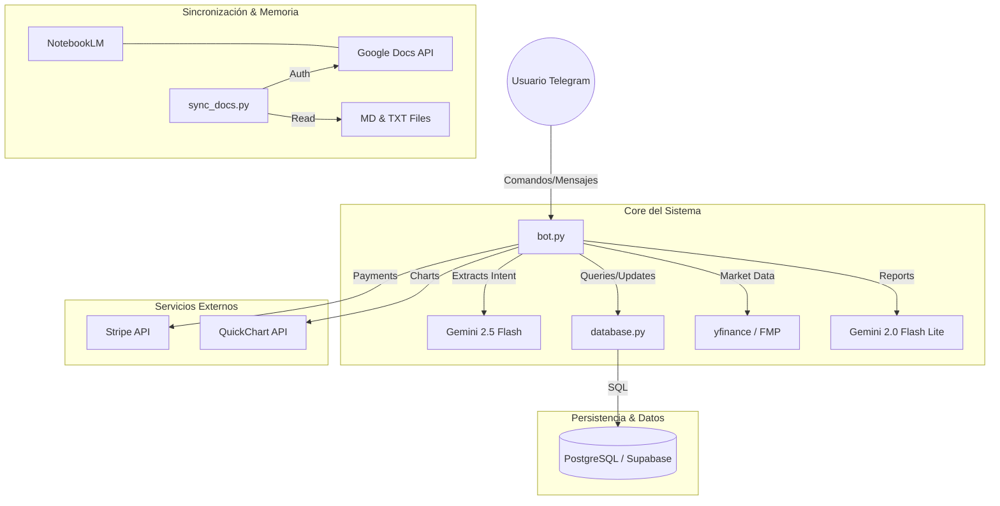

# 🗺️ MAPA DE DEPENDENCIAS DEL PROYECTO

Cualquier cambio en la conexión de módulos debe reflejarse aquí.

## 🏗️ Arquitectura de Módulos

## 📝 Descripción de Conexiones

| Módulo | Depende de | Propósito |
| :--- | :--- | :--- |
| `bot.py` | `database.py` | Acceso a créditos, caché y perfiles de usuario. |
| `bot.py` | `Gemini API` | NLP para extracción de métricas y generación de tesis. |
| `database.py` | `asyncpg` | Conexión asíncrona a la base de datos PostgreSQL. |
| `sync_docs.py` | `credentials.json` | Sincronización de la documentación local con la nube. |
| `fix_zombis.py` | `bot.py` | Refactorización y limpieza de funciones obsoletas. |

---

## 🚀 Flujo Crítico de Datos
1. **Entrada**: El usuario solicita un análisis.
2. **Procesamiento**: `bot.py` -> `Gemini 2.5` (Entiende) -> `yfinance` (Calcula) -> `database.py` (Caché).
3. **Salida**: `QuickChart` (Gráfico) -> `Gemini 2.0` (Tesis) -> Telegram.
4. **Memoria**: Cualquier fallo o cambio estructural se anota en `DECISION_LOG.md`.
